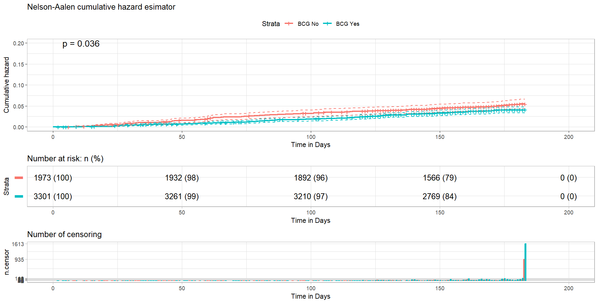
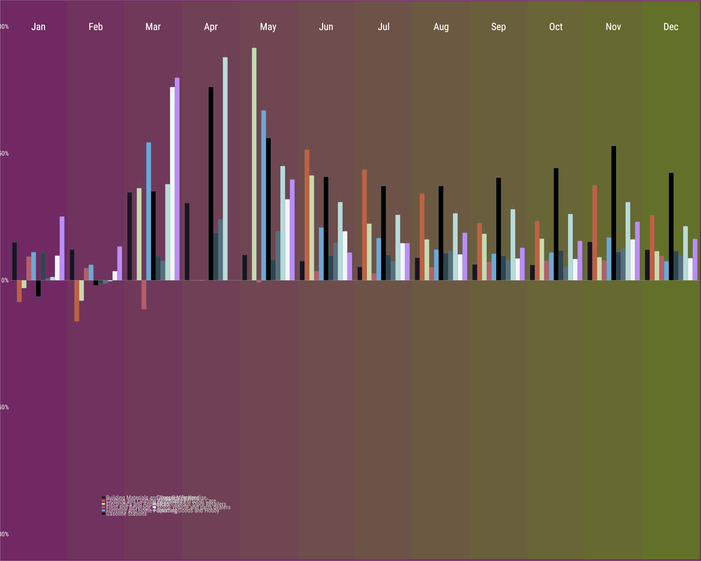

# Data Analysis and Visualization
A personal project to improve my data analysis skills in R using dataset from [#tidytuesday data](https://github.com/rfordatascience/tidytuesday). Some of these projects were created while watching David Robinson screencast on YouTube and others were inspired by data analyst on twitter.

## Gallery
* [BCG Vaccination in Guinea-Bissau](#bissau)
* [Global Malaria Mortality Map](#Malaria-map)
* [Retail sales in the USA](#retail-sales-graph)

## BCG Vaccination in Guinea-Bissau

## Global Malaria Mortality Map

## Retail Sales in the USA

