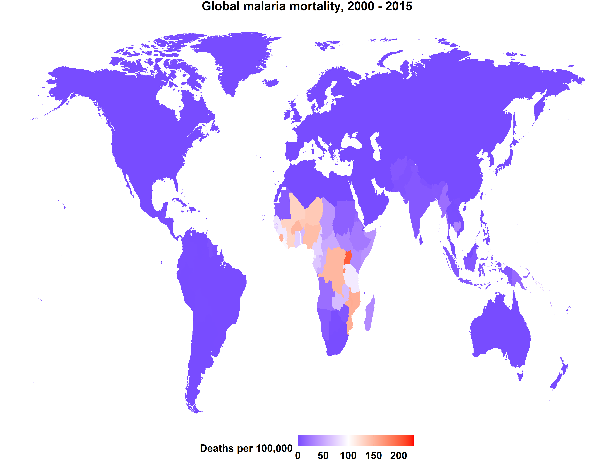

# Data Analysis and Visualization
A personal project to improve my data analysis skills in R using dataset from [#tidytuesday data](https://github.com/rfordatascience/tidytuesday). Some of these projects were created while watching David Robinson screencast on YouTube and others were inspired by data analyst on twitter.

## Gallery

* [Malaria in Africa Map](#animated-malaria-map)
* [Retail sales in the USA](#retail-sales-graph)

## Malaria in Africa Map

## Retail Sales in the USA

